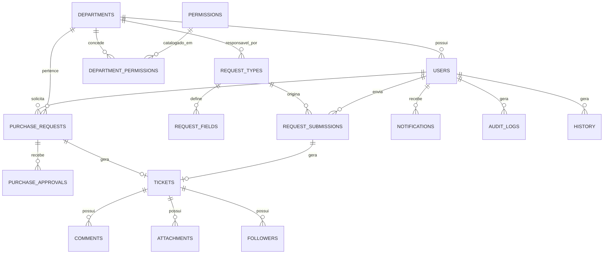

# Sistema de Gestão de Solicitações

Sistema corporativo completo para gestão de **Solicitações de Compra** (com aprovação entre departamentos) e de **Solicitações internas genéricas** (Ordem de Serviço, RH, Financeiro etc.) cadastráveis pelo administrador via **Tipos de Solicitação** com formulário dinâmico próprio. Ambas convergem para o mesmo **Kanban de Tickets**, que passou a exibir apenas as solicitações destinadas ao departamento do usuário logado. Conta ainda com controle de acesso baseado em permissões (RBAC), notificações em tempo real (Socket.io + e-mail SMTP), histórico de auditoria e dashboard analítico (exclusivo de Compras).

## Sumário

1. [Arquitetura](#arquitetura)
2. [Stack Tecnológica](#stack-tecnológica)
3. [Estrutura de Pastas](#estrutura-de-pastas)
4. [Modelagem do Banco de Dados](#modelagem-do-banco-de-dados)
5. [Como Executar (Docker)](#como-executar-docker)
6. [Como Executar (Desenvolvimento local)](#como-executar-desenvolvimento-local)
7. [Variáveis de Ambiente](#variáveis-de-ambiente)
8. [Usuários Padrão (Seed)](#usuários-padrão-seed)
9. [Fluxo de Negócio](#fluxo-de-negócio)
10. [Tipos de Solicitação (Formulários Dinâmicos)](#tipos-de-solicitação-formulários-dinâmicos)
11. [RBAC — Permissões](#rbac--permissões)
12. [API e Documentação Swagger](#api-e-documentação-swagger)
13. [Uploads de Anexos](#uploads-de-anexos)
14. [Notificações](#notificações)
15. [Deploy em Produção](#deploy-em-produção)
16. [Segurança](#segurança)

---

## Arquitetura

```
                         ┌────────────────────┐
                         │        Nginx        │  :8080 (reverse proxy)
                         └─────────┬───────────┘
                    ┌──────────────┼───────────────┐
                    │              │               │
             /  (SPA)         /api (REST)     /socket.io (WS)
                    │              │               │
           ┌────────▼───────┐ ┌────▼─────────────────▼───┐
           │  Frontend (Nginx)│ │   Backend (Node/Express) │
           │  React 19 + Vite │ │   TypeORM + Socket.io    │
           └──────────────────┘ └────────────┬──────────────┘
                                              │
                                     ┌────────▼─────────┐
                                     │    PostgreSQL     │
                                     └────────────────────┘
```

- **Frontend**: SPA em React 19, servida por um Nginx próprio dentro do container `frontend`.
- **Backend**: API REST em Express + TypeORM, com WebSocket via Socket.io no mesmo processo HTTP.
- **Nginx (proxy)**: ponto único de entrada, roteando `/` para o frontend, `/api` e `/socket.io` para o backend, e servindo `/uploads` com cache.
- **PostgreSQL**: banco relacional único, com migrations versionadas.

## Stack Tecnológica

**Frontend:** React 19, TypeScript, Vite, React Router DOM, Tailwind CSS, componentes estilo shadcn/ui (Radix UI + CVA), Lucide React, TanStack Query, Axios, React Hook Form + Zod, dnd-kit, Socket.io Client, Recharts.

**Backend:** Node.js, Express, TypeScript, TypeORM, PostgreSQL, JWT (access + refresh token), bcrypt, class-validator/class-transformer, Multer, Nodemailer, Socket.io, Pino (logs estruturados), Swagger (OpenAPI).

**Infraestrutura:** Docker Compose, Nginx (reverse proxy), volumes persistentes, healthchecks, restart automático.

## Estrutura de Pastas

```
purchase-system/
├── backend/
│   └── src/
│       ├── config/            # env, logger, data-source, swagger
│       ├── database/
│       │   ├── entities/      # Entidades TypeORM
│       │   ├── migrations/    # Migrations versionadas
│       │   └── seeds/         # Seed inicial (admin, departamentos, permissões)
│       ├── middlewares/       # auth, RBAC, upload, error handler, rate limit
│       ├── modules/           # auth, users, departments, purchase-requests,
│       │                      # request-types, request-submissions, tickets,
│       │                      # notifications, settings, audit, dashboard
│       ├── sockets/           # Socket.io
│       ├── mailer/            # Nodemailer / SMTP
│       └── utils/             # ApiError, ApiResponse, paginação, protocolo
├── frontend/
│   └── src/
│       ├── components/ui/     # Primitivas (Button, Dialog, Table, Toast...)
│       ├── components/shared/ # Sidebar, Header, DataTable, PermissionGate...
│       ├── pages/             # Telas da aplicação
│       ├── layouts/           # AppLayout, AuthLayout
│       ├── contexts/          # Auth, Theme, Socket
│       ├── hooks/             # usePermission, useDebounce, useSocketEvents
│       ├── services/          # Clientes HTTP por módulo
│       └── types/              # Tipos compartilhados com o backend
├── nginx/
│   └── nginx.conf             # Reverse proxy
├── docker-compose.yml
└── .env.example
```

## Modelagem do Banco de Dados

Entidades principais e relacionamentos (Diagrama ER simplificado):



Todo `Ticket` nasce de **exatamente uma** das duas origens acima — `PurchaseRequest` (fluxo de Compra, com aprovação) ou `RequestSubmission` (demais tipos, sem aprovação) — nunca as duas. É por isso que as duas relações com `TICKETS` no diagrama são opcionais (`o|`), ao contrário da constraint antiga que exigia sempre uma Solicitação de Compra.

Tabelas: `users`, `departments`, `permissions`, `department_permissions`, `refresh_tokens`, `purchase_requests`, `purchase_approvals`, `request_types`, `request_fields`, `request_submissions`, `tickets`, `comments`, `attachments`, `followers`, `notifications`, `history`, `audit_logs`, `settings`.

A migration inicial (`backend/src/database/migrations/1700000000000-InitialSchema.ts`) cria a base do schema; migrations seguintes (`1700000000001` a `1700000000008`) evoluem o schema incrementalmente — a mais recente (`1700000000007-AddRequestTypes.ts` + `1700000000008-AddRequestSubmissionOrganization.ts`) introduz `request_types`/`request_fields`/`request_submissions` e relaxa `tickets.purchase_request_id` para aceitar `NULL`.

## Como Executar (Docker)

Pré-requisitos: Docker e Docker Compose instalados.

```bash
# 1. Clonar/copiar o projeto e entrar na pasta raiz
cd purchase-system

# 2. Criar o arquivo de variáveis de ambiente
cp .env.example .env
# Edite o .env e ajuste POSTGRES_PASSWORD, JWT_SECRET, JWT_REFRESH_SECRET, etc.

# 3. Subir todos os serviços
docker compose up -d --build

# 4. Rodar as migrations dentro do container do backend
docker compose exec backend npm run migration:run

# 5. Popular o banco com dados iniciais (departamentos, permissões, usuário admin)
docker compose exec backend npm run seed
```

A aplicação estará disponível em `http://localhost:8080` (porta definida em `FRONTEND_PORT` no `.env`).

- Frontend: `http://localhost:8080`
- API: `http://localhost:8080/api`
- Swagger: `http://localhost:8080/api/docs`

## Como Executar (Desenvolvimento local)

### Backend

> Em desenvolvimento local, use os scripts `*:dev` (rodam via `ts-node` direto do `src/`). Dentro do container Docker, `npm run migration:run` e `npm run seed` (sem sufixo) operam sobre o código já compilado em `dist/`, sem depender de `ts-node`.

```bash
cd backend
cp .env.example .env   # ajuste os dados de conexão com um Postgres local
npm install
npm run migration:run:dev
npm run seed:dev
npm run dev             # http://localhost:3333
```

### Frontend

```bash
cd frontend
cp .env.example .env    # VITE_API_URL=http://localhost:3333/api
npm install
npm run dev              # http://localhost:5173
```

## Variáveis de Ambiente

Veja `.env.example` na raiz (usado pelo `docker-compose.yml`) e os `.env.example` específicos de `backend/` e `frontend/` para desenvolvimento local. Principais variáveis:

| Variável | Descrição |
|---|---|
| `POSTGRES_*` | Conexão com o PostgreSQL |
| `JWT_SECRET` / `JWT_REFRESH_SECRET` | Chaves de assinatura dos tokens (access e refresh) |
| `CORS_ORIGIN` | Origem(ns) permitida(s) para chamadas cross-origin (`*` libera todas — padrão no `.env.example` da raiz, já que o Nginx expõe frontend e API juntos) |
| `SMTP_*` | Configuração inicial de e-mail (também editável pela tela **Configurações**) |
| `VITE_API_URL` / `VITE_SOCKET_URL` | Endpoints consumidos pelo frontend. No deploy via Docker, deixe em branco/`/api` (padrão) para usar caminhos relativos — assim o sistema funciona em `localhost`, no IP da rede local ou em qualquer domínio, sem rebuildar a imagem. Só defina um valor absoluto se o frontend for servido de um host diferente do backend. |

## Usuários Padrão (Seed)

O seed (`npm run seed` / `seed:dev`) cria só um usuário — os demais departamentos (Tecnologia da Informação, Compras, Financeiro) já saem com as permissões certas configuradas, prontos para você cadastrar usuários reais neles em **Usuários**:

| Login | Senha | Departamento | Perfil |
|---|---|---|---|
| `admin` | `Admin@123` | Administração | Administrador do sistema (acesso total) |

> Altere a senha padrão antes de qualquer uso em produção. O seed é idempotente — pode ser rodado de novo com segurança (ex.: após uma migration nova) sem duplicar ou apagar dados já existentes, inclusive reativando um registro (departamento/organização/usuário) que tenha sido excluído pela interface.

## Fluxo de Negócio

**Solicitação de Compra:**
`Rascunho` → `Aguardando Aprovação` → `Aprovada` (cria Ticket automaticamente) **ou** `Reprovada` (motivo obrigatório) — ou `Cancelada` a qualquer momento antes da decisão.

A aprovação só pode ser realizada por um usuário de **departamento diferente** do solicitante e que possua a permissão `APPROVE_PURCHASE_REQUEST`. Ao aprovar, o sistema cria automaticamente um **Ticket** vinculado, que entra na coluna **Pendente** do Kanban.

**Solicitação genérica** (Ordem de Serviço, RH, Financeiro etc. — ver seção seguinte): sem etapa de aprovação. Ao enviar o formulário em **Nova Solicitação**, o Ticket já nasce direto na coluna **Pendente** do Kanban do departamento responsável pelo tipo.

**Ticket (Kanban):**
Colunas `Pendente → Em andamento → Resolvido/Cancelado`, com reabertura permitida — mesmas 4 colunas para qualquer origem (Compra ou solicitação genérica). Toda movimentação, comentário, anexo, troca de responsável/prioridade é registrada na **Timeline** (nunca apagada) e dispara notificações em tempo real (Socket.io) e por e-mail (conforme preferência do usuário).

Comentar em um ticket adiciona automaticamente o autor como **acompanhante**, que passa a receber notificações de toda a atividade do ticket.

O Kanban e a tela de **Arquivados** exibem, por padrão, apenas os tickets do **departamento do usuário logado** (qualquer que seja a origem); administradores/usuários com a permissão `SYSTEM_ADMIN` continuam vendo todos os departamentos.

## Tipos de Solicitação (Formulários Dinâmicos)

Em **Sistema → Tipos de Solicitação** (permissão `MANAGE_REQUEST_TYPES`), o administrador cadastra novos tipos de solicitação interna — nome, descrição, ícone e o **departamento responsável** (dono do Kanban onde os tickets desse tipo vão cair) — e define o formulário próprio de cada um em **Campos**, com os tipos de campo: Texto, Texto longo, Número, Data, Seleção, Múltipla seleção, Checkbox e Upload de arquivo (obrigatoriedade e opções configuráveis por campo).

Cada tipo aparece como um cartão na tela **Nova Solicitação**; o usuário escolhe o cartão, preenche o formulário correspondente (incluindo a organização, do mesmo jeito que a Solicitação de Compra) e envia — o Ticket é criado automaticamente, sem aprovação.

Cada tipo também precisa ter ao menos uma **organização** marcada (na própria tela de Tipos de Solicitação) para aparecer — sem nenhuma marcada, ele fica oculto pra todo mundo até o admin configurar. Só vê o cartão quem pertence a um departamento com acesso a alguma das organizações marcadas (mesma regra de acesso já usada em Solicitações de Compra/Tickets). O card semente de Compra ignora essa regra e é sempre visível.

A **Solicitação de Compra** continua com sua tela e fluxo próprios, intocados — ela só aparece como mais um cartão em "Nova Solicitação" (um tipo semente, fixo, que não pode ser editado/excluído) para dar uma entrada única a todas as solicitações.

Anexos de campos do tipo "Upload de arquivo" seguem o mesmo armazenamento descrito em [Uploads de Anexos](#uploads-de-anexos). O card de **Nota Fiscal** no detalhe do ticket continua exclusivo de tickets originados de Solicitação de Compra.

## RBAC — Permissões

Permissões pertencem ao **Departamento**; todo usuário herda as permissões do seu departamento. Um usuário marcado como `isAdmin` ou pertencente a um departamento com a permissão `SYSTEM_ADMIN` tem acesso irrestrito. O catálogo completo de permissões pode ser gerenciado em **Departamentos → Permissões**:

`CREATE_PURCHASE_REQUEST`, `EDIT_PURCHASE_REQUEST`, `CANCEL_PURCHASE_REQUEST`, `VIEW_PURCHASE_REQUEST`, `APPROVE_PURCHASE_REQUEST`, `MOVE_TICKET`, `RESOLVE_TICKET`, `CANCEL_TICKET`, `DELETE_TICKET`, `COMMENT_TICKET`, `ATTACH_FILES`, `VIEW_TICKET`, `VIEW_ARCHIVED_TICKETS`, `EXPORT_INVOICES`, `CREATE_TAG`, `VIEW_DEVICE`, `CREATE_DEVICE`, `EDIT_DEVICE`, `DELETE_DEVICE`, `REGISTER_DEVICE_MAINTENANCE`, `MANAGE_USERS`, `MANAGE_DEPARTMENTS`, `MANAGE_SETTINGS`, `SYSTEM_ADMIN`, `MANAGE_REQUEST_TYPES` (cadastrar/editar Tipos de Solicitação e seus campos), `CREATE_REQUEST` (enviar qualquer solicitação dinâmica — uma permissão só, vale para todos os tipos ativos), `VIEW_DASHBOARD` (acessar o Dashboard — antes aberto a qualquer autenticado, agora precisa ser concedido).

`VIEW_TICKET`/`MOVE_TICKET`/`RESOLVE_TICKET`/`CANCEL_TICKET`/`COMMENT_TICKET`/`ATTACH_FILES`/`VIEW_ARCHIVED_TICKETS`/`DELETE_TICKET` agora regem o Kanban/Arquivados **de qualquer origem** (Compra ou solicitação dinâmica) — não há permissão separada por tipo de solicitação; o que muda quem vê o quê é o escopo por departamento descrito em [Fluxo de Negócio](#fluxo-de-negócio).

Todas as rotas do backend validam a permissão via middleware `authorize(...)`; o frontend também oculta ações não permitidas (`PermissionGate`), mas a validação real sempre ocorre no servidor.

## API e Documentação Swagger

Com o backend em execução, a documentação interativa (OpenAPI) fica disponível em:

```
http://localhost:8080/api/docs      (via Docker/Nginx)
http://localhost:3333/api/docs      (desenvolvimento local)
```

Todas as respostas seguem o padrão `{ success, data, meta? }` (sucesso) ou `{ success: false, message, details? }` (erro).

## Uploads de Anexos

Os arquivos são salvos no backend em:

```
backend/uploads/ANO/MES/PROTOCOLO/arquivo.ext
# Exemplo:
backend/uploads/2026/07/CP-000123/orcamento.pdf
```

Metadados (nome original, nome físico, caminho, tipo, tamanho, usuário e data) são persistidos na tabela `attachments`. O volume `backend_uploads` no `docker-compose.yml` garante persistência entre reinicializações dos containers.

Campos do tipo "Upload de arquivo" em solicitações dinâmicas seguem a mesma pasta/convenção acima (o protocolo usado é sempre o do Ticket gerado, nunca um número à parte). Como o Ticket só é confirmado durante o próprio envio do formulário, o arquivo fica retido em memória (não em disco) até a solicitação ser gravada com sucesso — só então é escrito no caminho final, evitando arquivo órfão apontando para um protocolo que nunca chegou a existir.

## Notificações

- **Tempo real:** Socket.io, autenticado via JWT no handshake; cada usuário entra em uma room própria (`user:<id>`).
- **E-mail:** Nodemailer, com configuração de SMTP editável em **Configurações** (inclui botão "Testar Conexão").
- Cada usuário escolhe em **Meu Perfil** se deseja receber apenas e-mail, apenas notificações internas, ou ambos.

## Deploy em Produção

1. Gere segredos fortes para `JWT_SECRET`, `JWT_REFRESH_SECRET` e `POSTGRES_PASSWORD`.
2. Os padrões de `VITE_API_URL`/`VITE_SOCKET_URL` (caminhos relativos) e `CORS_ORIGIN=*` já funcionam para acesso via `localhost`, IP da rede local ou domínio público sem alteração. Só restrinja `CORS_ORIGIN` para domínio(s) específicos se quiser reduzir a superfície de CORS além do que o JWT já protege.
3. Configure um certificado TLS (ex.: Nginx + Let's Encrypt, ou um balanceador de carga com HTTPS na frente do container `nginx`).
4. Execute `docker compose up -d --build`, depois `migration:run` e `seed` (apenas na primeira execução).
5. Configure backups periódicos do volume `postgres_data` e do volume `backend_uploads`.

## Segurança

- Senhas com hash `bcrypt` (10 rounds).
- Autenticação via JWT de curta duração + refresh token rotativo (revogado a cada uso/logout).
- `helmet`, `cors` restrito por origem, `express-rate-limit` (global e reforçado em `/auth/login`). O limite geral é contado por usuário autenticado (extraído do JWT), não por IP — assim usuários atrás do mesmo NAT/proxy não competem pela mesma cota. Ajustável via `RATE_LIMIT_MAX` (padrão 600 requisições/15min por usuário) e `RATE_LIMIT_WINDOW_MS` no `.env`; aumente se tiver muitos usuários simultâneos e reinicie o backend (`docker compose restart backend`).
- Validação de entrada em 100% dos endpoints com `class-validator`.
- RBAC obrigatório no backend — o frontend nunca é a única camada de proteção.
- Soft delete em `users`, `departments` e `purchase_requests` para preservar histórico e auditoria.
- Auditoria completa (`audit_logs`) de login/logout, CRUD, uploads, downloads, comentários, movimentações e mudanças de permissão, com IP e usuário.
- Isolamento de rede: só o container `nginx` publica porta pro host (`FRONTEND_PORT`, padrão 8080). `postgres`, `backend` e `frontend` usam `expose` no `docker-compose.yml` — existem só dentro da rede Docker `purchase_network`, inacessíveis diretamente de fora da máquina/rede do host. Pra depurar o banco diretamente, use `docker compose exec postgres psql -U $POSTGRES_USER -d $POSTGRES_DB` em vez de conectar por um client externo na porta 5432.
- Controle de acesso por objeto em `tickets`: além da permissão (RBAC) e do escopo por organização, toda operação sobre um ticket específico (ver, comentar, mover, anexar, arquivar...) confere se o usuário pertence ao **departamento do ticket**, é o **solicitante original** ou o **responsável atribuído** — evita que outro departamento (ou alguém com a permissão global mas fora do departamento) acesse um ticket por link direto/ID adivinhado, ainda que ele não apareça na listagem/Kanban dele. Administradores (`isAdmin`/`SYSTEM_ADMIN`) continuam com acesso irrestrito.
